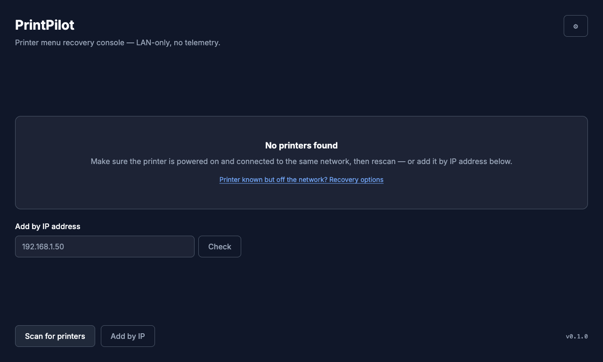
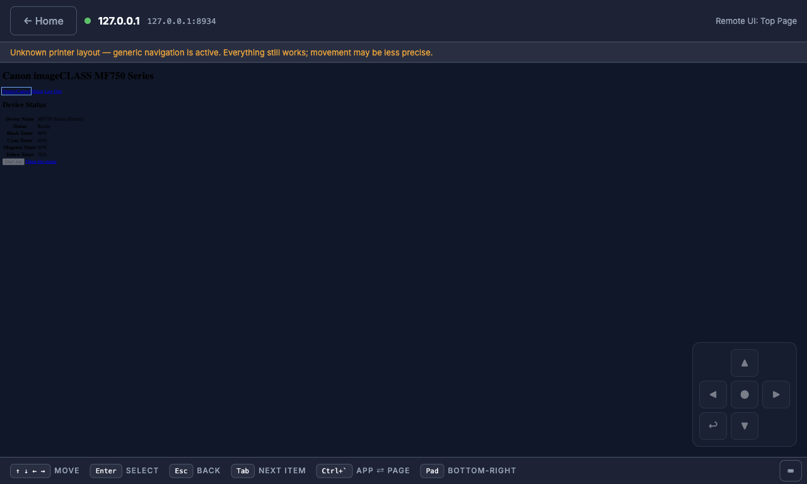
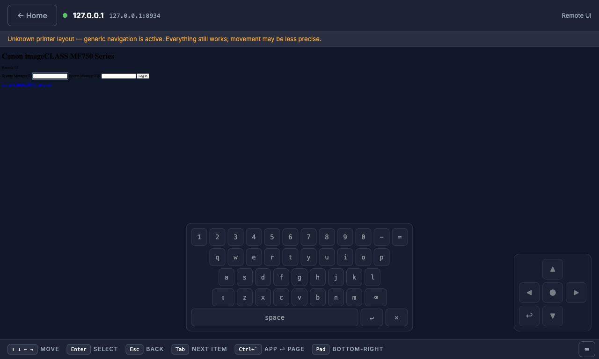
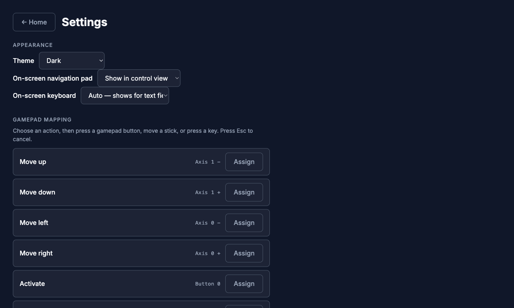

# PrintPilot


`tests: 232 unit + 16 e2e passing`

PrintPilot is an open source desktop app (Windows + Linux) for operating a
network printer's menu when its control panel is unusable — born from a Canon
imageCLASS MF750 with a dead touchscreen. It wraps the printer's built-in web
"Remote UI" and adds full keyboard and gamepad navigation, so every panel
task stays reachable without touching the panel.

LAN-only. No accounts, no sync, no telemetry.

## What it looks like

| Home | Control view |
| ---- | ------------ |
|  |  |

| On-screen keyboard + D-pad | Settings |
| -------------------------- | -------- |
|  |  |

(Screenshots are captured against the mock Canon fixtures by
`npm run screenshots` — see `e2e/screenshots.spec.ts`.)

## Features

- **Discovery** — finds printers on the LAN via mDNS + SNMP probes; manual
  add-by-IP with a reachability pre-check when discovery finds nothing.
- **Control view** — embeds the printer's Remote UI with a status strip,
  error recovery (never a raw error page), and an open-in-browser fallback.
- **Keyboard navigation** — full panel control: arrows/Tab to move, Enter to
  select, Esc for back, ``Ctrl+` `` to cross between the app and the page.
- **Gamepad navigation** — D-pad/stick to move, A to select, B for back,
  with press-to-assign remapping in Settings.
- **Profiles** — multiple printers saved locally; Remote UI PINs stored in
  the OS keychain (Electron `safeStorage`), never in plain files.
- **Hardened by default** — the embedded page can only navigate within the
  printer, all Chromium permissions are denied, crash capture and logs stay
  on the device. See `docs/security-audit-2026-08-17.md`.

## Status

[v0.1.0](https://github.com/qtrcipher/printpilot/releases/tag/v0.1.0) is
released and verified against a real Canon MF750 on-device. The test fixtures
are still hand-built mocks modeled on that device — recorded-device fixtures
are the next milestone. See `PROGRESS.md` for the roadmap.

## Install

Download prebuilt packages from
[GitHub Releases](https://github.com/qtrcipher/printpilot/releases):
Windows (NSIS installer or portable `.exe`) and Linux (AppImage or `.deb`).
Each release ships per-platform `SHA256SUMS-*.txt` files so you can verify
the download.

To build from source instead:

## Quick start

Requires Node.js 22+ and npm.

```sh
npm install
npm run dev        # launch the app in dev mode
npm test           # unit tests (Vitest)
npm run test:e2e   # Playwright Electron smoke test (builds first)
npm run screenshots # regenerate docs/screenshots/*.png (builds first)
npm run typecheck
```

Reproducible Linux build via Docker:

```sh
docker build -t printpilot-build .
docker run --rm -v "$PWD":/app -w /app printpilot-build
```

## Supported printers

| Vendor | Series | Discovery | Control (Remote UI navigation) |
| ------ | ------ | --------- | ------------------------------ |
| Canon  | imageCLASS MF750 series (MF753Cdw / MF751Cdw) | mDNS + SNMP, tested | Targeted adapter (`canon-mf750`). **Fixtures are mocks awaiting hardware recording** — the layout is modeled on, not yet recorded from, the real Remote UI. |
| Canon  | Other imageCLASS with the same Remote UI generation | mDNS + SNMP, tested | Likely works via the vendor/generic adapter fallback. **Unverified — help wanted.** |
| Other vendors (HP, Brother, Epson, …) | Any with a web UI | Discovery works | Control falls back to the generic adapter (focus ring over all interactive elements). **Unverified — help wanted.** |

**Help wanted: hardware reports.** If you run PrintPilot against a real
printer — especially an MF750 — please report what worked and what didn't,
or record real Remote UI fixtures (see `CONTRIBUTING.md` for the recorder).

Per-model support ships as data (adapter manifests), so contributors can add
models without touching core code. What's known about the Remote UI protocol:
`docs/protocols/canon-remote-ui.md`.

## Privacy

PrintPilot talks only to printers on your local network. No accounts, no
telemetry, no analytics, no crash upload. Printer credentials (Remote UI
PINs) are encrypted by your OS keychain (Electron `safeStorage`) and never
leave the device. The app itself makes no internet requests at all — there
is not even an update check. Links you explicitly click (Canon support, the
GitHub project) open in your own browser; everything else stays on the LAN.
Details: `docs/decisions/no-telemetry.md`.

## Contributing

See `CONTRIBUTING.md` for dev setup, test rules, the fixture recorder, and
the adapter authoring guide. House rules live in `AGENTS.md`; roadmap and
progress in `PROGRESS.md`; the validated design is in
`docs/plans/2026-08-16-printpilot-design.md`.

- Security audit: `docs/security-audit-2026-08-17.md`
- Decisions: `docs/decisions/no-telemetry.md`
- Release process: `RELEASE.md`

## License

[GPLv3](LICENSE).
